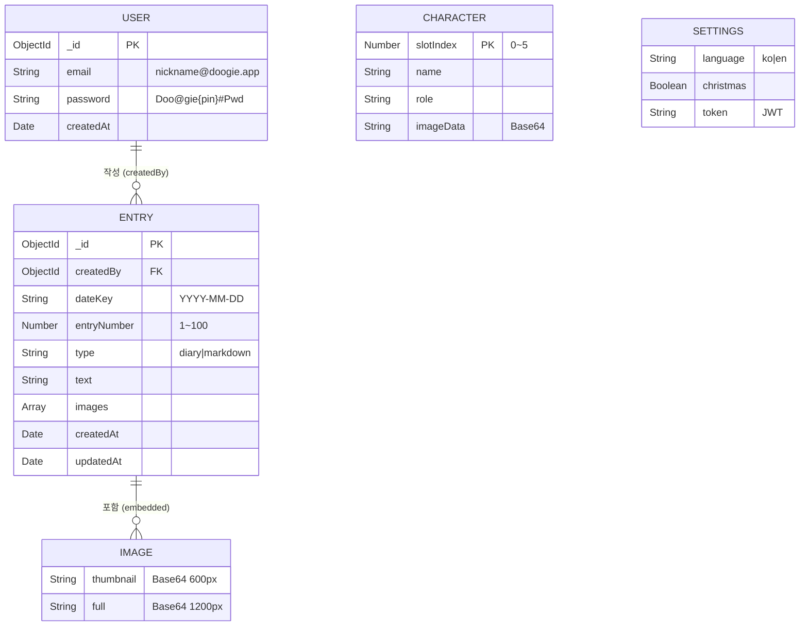
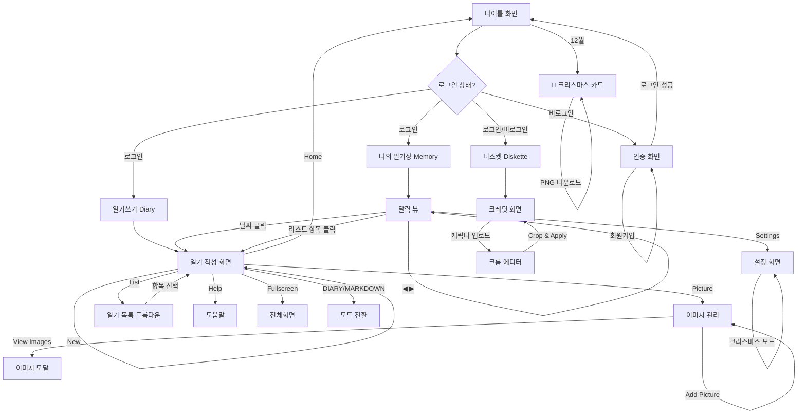
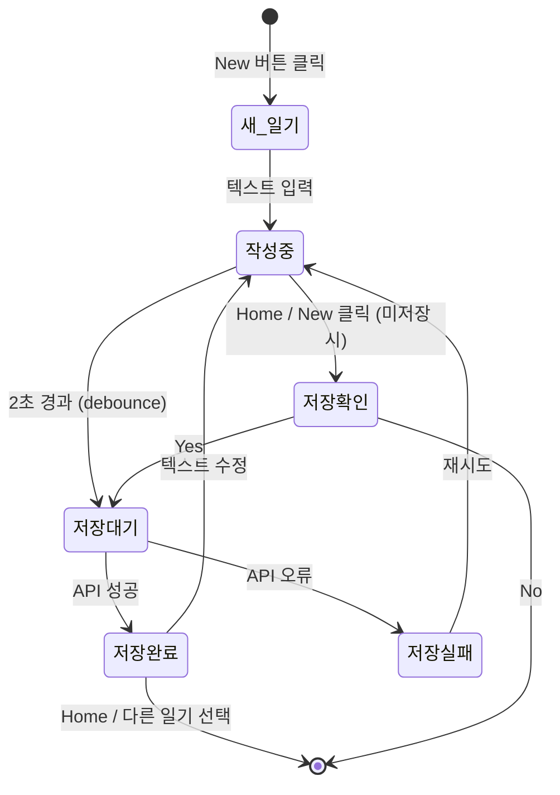
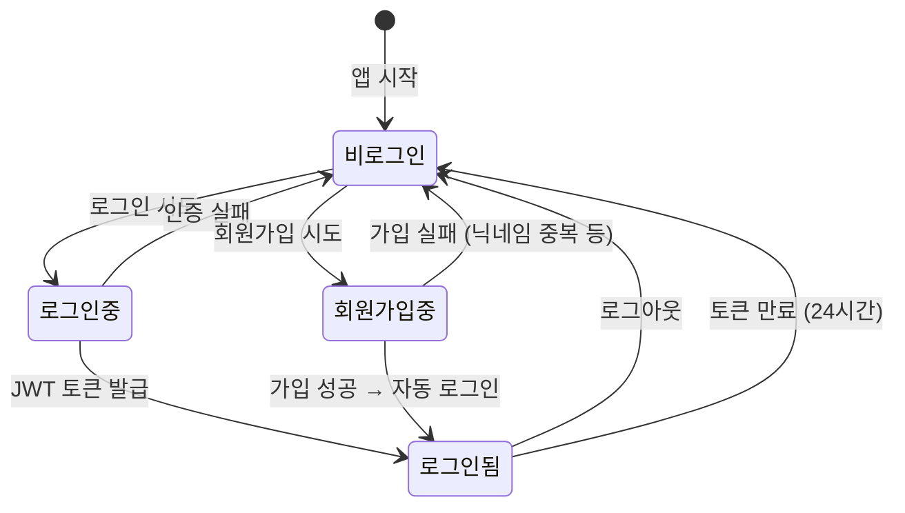

# DOOGIE - Domain Model (도메인 모델)

> 엔티티 간 관계와 시스템 경계를 정의하는 문서

**버전**: 1.0
**최종 수정일**: 2026-02-18
**프로젝트**: DOOGIE Diary

---

## 1. 엔티티 관계도 (ERD)



---

## 2. 시스템 경계 (Bounded Context)

### 2.1 컨텍스트 맵

```
┌─────────────────────────────────────────────────────────┐
│                    DOOGIE Application                     │
│                                                           │
│  ┌──────────────┐  ┌──────────────┐  ┌───────────────┐  │
│  │  인증 컨텍스트  │  │  일기 컨텍스트  │  │ 프레젠테이션    │  │
│  │  (Auth)       │  │  (Diary)      │  │ (Presentation) │  │
│  │               │  │               │  │                │  │
│  │ - 회원가입     │  │ - CRUD        │  │ - 크레딧 화면   │  │
│  │ - 로그인      │  │ - 이미지 처리   │  │ - 캐릭터 슬롯   │  │
│  │ - 세션 관리    │  │ - 마크다운 모드  │  │ - NYC 스카이라인 │  │
│  │ - 닉네임 변환  │  │ - 달력 뷰      │  │ - 자동차 애니    │  │
│  │               │  │ - 자동 저장     │  │                │  │
│  └───────┬───────┘  └───────┬───────┘  └───────┬────────┘  │
│          │                  │                   │           │
│          ▼                  ▼                   ▼           │
│  ┌──────────────────────────────────────────────────────┐  │
│  │                   공통 인프라 (Shared)                   │  │
│  │  - 설정 관리 (언어, 크리스마스 모드)                       │  │
│  │  - UI 테마 (DOS 녹색 디자인 시스템)                       │  │
│  │  - 반응형 레이아웃 (4:3 비율)                             │  │
│  └──────────────────────────────────────────────────────┘  │
└─────────────────────────────────────────────────────────┘
                              │
                              ▼
                 ┌──────────────────────┐
                 │   External Services   │
                 │                      │
                 │  - Bkend API Server  │
                 │  - CDN (폰트/라이브러리)│
                 └──────────────────────┘
```

### 2.2 컨텍스트별 책임

| 컨텍스트 | 책임 | 저장소 | 외부 의존성 |
|----------|------|--------|------------|
| **Auth** | 사용자 인증, 세션 유지 | Bkend Auth + localStorage(token) | Bkend Auth API |
| **Diary** | 일기 CRUD, 이미지 처리, 마크다운 | Bkend entries 테이블 | Bkend Data API, Marked.js, Mermaid.js |
| **Presentation** | 크레딧 화면, 캐릭터 관리 | IndexedDB (로컬) | gif.js, html2canvas |
| **Shared** | 설정, 테마, 레이아웃 | localStorage | Google Fonts |

---

## 3. 도메인 규칙 (Domain Rules)

### 3.1 일기 작성 규칙

| # | 규칙 | 검증 위치 |
|---|------|----------|
| R1 | 로그인한 사용자만 일기 작성 가능 | Frontend + Backend |
| R2 | 하루 최대 100개 (diary + markdown 합산) | Frontend + Backend |
| R3 | entryNumber는 자동 계산 (기존 최대값 + 1) | Frontend |
| R4 | 같은 (createdBy, dateKey, entryNumber) 조합은 유일 | Backend (Unique Index) |
| R5 | type 변경 불가 (diary ↔ markdown) | Frontend |
| R6 | 텍스트 미변경 시 저장 스킵 | Frontend |
| R7 | 입력 후 2초 뒤 자동 저장 (debounce) | Frontend |

### 3.2 인증 규칙

| # | 규칙 | 검증 위치 |
|---|------|----------|
| A1 | 닉네임 2~12자 (한글/영문/숫자) | Frontend |
| A2 | PIN 숫자 4자리 (0000~9999) | Frontend |
| A3 | 닉네임 중복 불가 | Backend |
| A4 | JWT 토큰 24시간 유효 | Backend |
| A5 | 토큰 만료 시 자동 로그아웃 | Frontend |

### 3.3 이미지 규칙

| # | 규칙 | 검증 위치 |
|---|------|----------|
| I1 | 모든 이미지는 픽셀화 처리 (3px 단위) | Frontend |
| I2 | 녹색 5단계 팔레트만 사용 | Frontend |
| I3 | Thumbnail: 600px 이하, Full: 1200px 이하 | Frontend |
| I4 | Base64 Data URL 형식으로 저장 | Frontend |

### 3.4 접근 권한 규칙

| # | 규칙 | 설명 |
|---|------|------|
| P1 | 비로그인 사용자는 일기 접근 불가 | guest: read=false |
| P2 | 본인 일기만 조회/수정/삭제 가능 | self role |
| P3 | 관리자는 모든 일기 접근 가능 | admin role |

---

## 4. 화면 흐름도 (Screen Flow)



---

## 5. 상태 다이어그램

### 5.1 일기 항목 상태



### 5.2 인증 상태



---

## 6. 배포 아키텍처

```
┌─────────────────────────────────────┐
│           Client (Browser)           │
│                                     │
│  ┌───────────────────────────────┐  │
│  │   index.html (Single File)    │  │
│  │   - HTML + CSS + JavaScript   │  │
│  │   - Canvas API (이미지 처리)    │  │
│  │   - Web Audio API (BGM)       │  │
│  └──────────────┬────────────────┘  │
│                 │                    │
│  ┌──────────────┴────────────────┐  │
│  │      Local Storage            │  │
│  │  - localStorage (설정, 토큰)   │  │
│  │  - IndexedDB (캐릭터)          │  │
│  └───────────────────────────────┘  │
└─────────────────┬───────────────────┘
                  │ HTTPS
                  ▼
┌─────────────────────────────────────┐
│         Vercel (Hosting)             │
│  - 정적 파일 서빙                      │
│  - API 프록시 (vercel.json)           │
└─────────────────┬───────────────────┘
                  │ HTTPS
                  ▼
┌─────────────────────────────────────┐
│      Bkend API Server                │
│  (api-enduser.bkend.ai)             │
│                                     │
│  ┌─────────────┐ ┌──────────────┐   │
│  │  Auth API    │ │  Data API    │   │
│  │  - signup    │ │  - entries   │   │
│  │  - signin    │ │    CRUD      │   │
│  │  - me        │ │              │   │
│  └─────────────┘ └──────────────┘   │
│                                     │
│  ┌───────────────────────────────┐  │
│  │       MongoDB (Storage)        │  │
│  └───────────────────────────────┘  │
└─────────────────────────────────────┘
```

---

## 7. 외부 라이브러리 의존성

| 라이브러리 | 버전 | 용도 | 로드 방식 |
|-----------|------|------|----------|
| Marked.js | latest | 마크다운 파싱 (GFM) | CDN |
| Mermaid.js | latest | 다이어그램 렌더링 | CDN |
| gif.js | latest | GIF 생성 (크리스마스 카드) | CDN |
| html2canvas | latest | PNG 캡처 (크리스마스 카드) | CDN |
| NeoDunggeunmo | - | 한글 폰트 | Google Fonts |
| VT323 | - | 영문 폰트 | Google Fonts |
| Press Start 2P | - | 타이틀 폰트 | Google Fonts |
| Vite | 6.x | 개발 서버/빌드 | npm |
