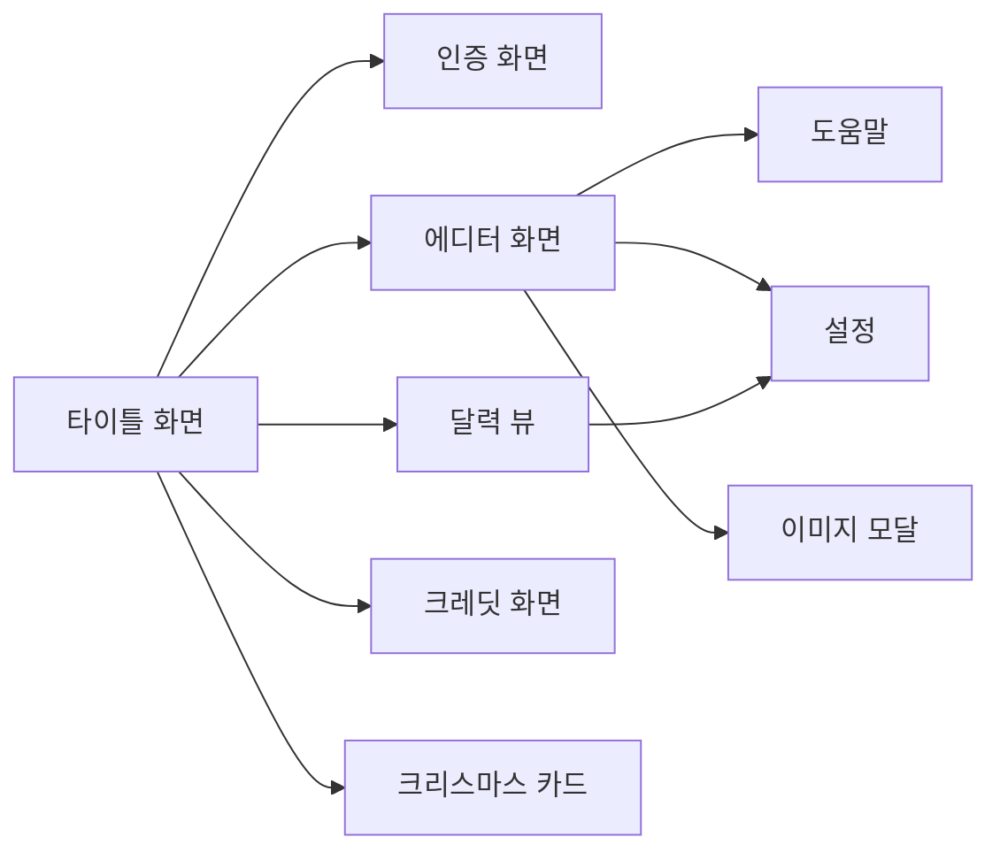

# DOOGIE - Mockup Spec (화면 명세서)

> 모든 화면의 구조, 컴포넌트, 인터랙션을 정의하는 문서

**버전**: 1.0
**최종 수정일**: 2026-02-18
**프로젝트**: DOOGIE Diary

---

## 1. 화면 목록 및 진입 경로



| # | 화면 | ID | 진입 조건 | 초기 display |
|---|------|----|----------|-------------|
| 1 | 타이틀 화면 | `titleScreen` | 앱 시작 | flex |
| 2 | 인증 화면 | `authScreen` | 로그인 메뉴 클릭 | none |
| 3 | 에디터 화면 (일기/마크다운) | `contentView` | 일기쓰기 메뉴 (로그인 필수) | none |
| 4 | 달력 뷰 | `calendarContainer` | 나의 일기장 메뉴 (로그인 필수) | none |
| 5 | 크레딧 화면 | `creditsScreen` | 디스켓 메뉴 | none |
| 6 | 도움말 | `helpScreen` | Help 메뉴 / F1 | none |
| 7 | 설정 | `settingsScreen` | 달력 뷰 Settings 버튼 | none |
| 8 | 이미지 모달 | `imageModal` | View Images | none |
| 9 | 크리스마스 카드 | `xmasCardScreen` | 🎄 메뉴 (12월) | none |

---

## 2. 화면 상세

### 2.1 타이틀 화면 (Title Screen)

```
┌─────────────────────────────────────┐
│           ✦  ✦    ✦                 │ ← 깜빡이는 별 (30개)
│      ✦                   ✦          │
│                                     │
│          D O O G I E                │ ← Press Start 2P, 82px
│                                     │   glitch 애니메이션
│          ▶ 일기쓰기                  │ ← 메뉴 항목
│            나의 일기장               │   선택 시 ▶ + 반전
│            디스켓                    │
│            로그인                    │
│                                     │
│   ✦         ✦                 ✦     │
└─────────────────────────────────────┘
```

**컴포넌트**:

| 컴포넌트 | 클래스/ID | 설명 |
|---------|-----------|------|
| 배경 별 | `.stars` > `.star` | 30개, 랜덤 위치, twinkle 애니메이션 |
| 로고 | `.logo` | "DOOGIE", glitch 애니메이션 |
| 메인 메뉴 | `.main-menu` > `.menu-item` | 4개 항목, 키보드 ↑↓ 선택 |
| 로그인 버튼 | `#authMenuItem` | 로그인 상태에 따라 텍스트 변경 |

**인터랙션**:

| 이벤트 | 동작 |
|--------|------|
| 메뉴 hover | 배경 녹색 반전, 텍스트 검정 |
| 메뉴 클릭 | 해당 화면으로 전환 |
| ↑↓ 키 | 메뉴 항목 순환 선택 |
| Enter 키 | 선택된 메뉴 실행 |
| 비로그인 시 일기쓰기 | 인증 화면으로 이동 |

---

### 2.2 인증 화면 (Auth Screen)

```
┌─────────────────────────────────────┐
│           ✦    ✦         ✦          │
│                                     │
│          D O O G I E                │ ← 타이틀 (작은 크기)
│                                     │
│     ┌─────────────────────────┐     │
│     │  [로그인]  [회원가입]     │     │ ← 탭 전환
│     │                         │     │
│     │  닉네임                  │     │
│     │  ┌─────────────────┐    │     │
│     │  │                 │ ✓  │     │ ← 실시간 중복 체크
│     │  └─────────────────┘    │     │
│     │                         │     │
│     │  PIN (숫자 4자리)        │     │
│     │  ┌─────────────────┐    │     │
│     │  │ ****             │    │     │ ← 마스킹
│     │  └─────────────────┘    │     │
│     │                         │     │
│     │  ┌─────────────────┐    │     │
│     │  │     로그인       │    │     │ ← 제출 버튼
│     │  └─────────────────┘    │     │
│     │                         │     │
│     │  ← 돌아가기              │     │
│     └─────────────────────────┘     │
└─────────────────────────────────────┘
```

**컴포넌트**:

| 컴포넌트 | 클래스/ID | 설명 |
|---------|-----------|------|
| 인증 컨테이너 | `.auth-container` | 중앙 정렬 폼 박스 |
| 탭 버튼 | `.auth-tab` | 로그인/회원가입 전환 |
| 닉네임 입력 | `#authNickname` | 2-12자, 실시간 중복 체크 |
| PIN 입력 | `#authPin` | 4자리 숫자, 마스킹 |
| 닉네임 상태 | `#nicknameStatus` | ✓ 사용 가능 / ✗ 중복 |
| 에러 메시지 | `#authError` | 에러 시 빨간 텍스트 |
| 제출 버튼 | `#authSubmitBtn` | 로그인/회원가입 실행 |
| 돌아가기 | `#authBack` | 타이틀 화면 복귀 |

**인터랙션**:

| 이벤트 | 동작 |
|--------|------|
| 탭 클릭 | 로그인 ↔ 회원가입 전환 (버튼 텍스트 변경) |
| 닉네임 입력 | debounce 후 중복 체크 API 호출 |
| 폼 제출 | 로그인/회원가입 API → 성공 시 에디터로 이동 |
| ← 돌아가기 | 타이틀 화면 복귀 |

---

### 2.3 에디터 화면 (Editor Screen)

```
┌─────────────────────────────────────────────────────────┐
│ Home  New  Save  Picture▾  List▾  Help  🎄  Full  0/100 │ ← 메뉴바
│ ──────────────────────────────────────────── DIARY [닉네임] Logout │
├─────────────────────────────────────────────────────────┤
│                                                         │
│  02/18/2026 WEDNESDAY                                   │ ← 날짜 헤더
│                                                         │
│  ┌──────────────────────┬──────────────────────┐        │
│  │                      │                      │        │
│  │   텍스트 에디터       │   이미지 영역         │        │
│  │                      │   (이미지 없으면      │        │
│  │   오늘의 일기를       │    숨김 + 텍스트      │        │
│  │   작성합니다...       │    100% 확장)         │        │
│  │                      │                      │        │
│  │                      │   ┌────┐ ┌────┐      │        │
│  │                      │   │ img│ │ img│      │        │
│  │                      │   └────┘ └────┘      │        │
│  │                      │   ┌────┐ ┌────┐      │        │
│  │                      │   │ img│ │ img│      │        │
│  │                      │   └────┘ └────┘      │        │
│  │                      │                      │        │
│  └──────────────────────┴──────────────────────┘        │
└─────────────────────────────────────────────────────────┘
```

**메뉴바 컴포넌트**:

| 컴포넌트 | 클래스/ID | 동작 |
|---------|-----------|------|
| Home | `.menu-item-top[data-action=home]` | 타이틀 화면 복귀 (저장 확인) |
| New | `.menu-item-top[data-action=new]` | 새 일기 생성 (100개 체크) |
| Save | `.menu-item-top[data-action=save]` | 수동 저장 (F2) |
| Picture ▾ | `.menu-item-top[data-action=picture]` | 드롭다운: Add / View Images |
| List ▾ | `.menu-item-top[data-action=list]` | 드롭다운: 일기 목록 (fixed) |
| Help | `.menu-item-top[data-action=help]` | 도움말 화면 (F1) |
| 🎄 Card | `#xmasCardMenu` | 크리스마스 카드 (12월만) |
| Fullscreen | `#fullscreenBtn` | 전체화면 전환 |
| 오늘 카운트 | `#todayCount` | "오늘 N/100" 표시 |
| DIARY/MARKDOWN | `#modeToggleBtn` | 모드 전환 토글 (Ctrl+M) |
| 닉네임 | `#userNickname` | 현재 사용자 표시 |
| Logout | `#logoutBtn` | 로그아웃 |

**에디터 영역**:

| 컴포넌트 | 클래스/ID | 설명 |
|---------|-----------|------|
| 날짜 헤더 | `#dateHeader` | "MM/DD/YYYY DAYOFWEEK" 형식 |
| 일반 에디터 | `#diaryEditorWrapper` | textarea + 커서 |
| 마크다운 에디터 | `#markdownEditorWrapper` | 툴바 + textarea + 프리뷰 |
| 이미지 영역 | `#imagesSection` | 이미지 Grid (0~N장) |
| 이미지 컨테이너 | `#imagesContainer` | Grid 레이아웃 |

**이미지 레이아웃 규칙**:

| 개수 | Grid | 비고 |
|------|------|------|
| 0장 | 숨김 | 텍스트 에디터 100% |
| 1장 | 1x1 | 전체 채움 |
| 2장 | 1x2 | 세로 2분할 |
| 3장 | 2x2 (첫째 span 2) | 상단 1개 넓게 |
| 4장+ | 2xN | 스크롤 가능 |

**드롭다운 규칙**:
- 하나 열리면 다른 것 자동 닫힘
- 외부 클릭 시 닫힘 (100ms 딜레이)
- List 드롭다운: `position: fixed`, `z-index: 9999`

---

### 2.4 마크다운 에디터 (Markdown Mode)

```
┌─────────────────────────────────────────────────────────┐
│ # │ B │ I │ </> │ 🔗 │ • │ ❝ │ ▦ │ ◈ │ │ 👁 Preview │ .md │ .html │
├─────────────────────────────────────────────────────────┤
│                                                         │
│  # 제목입니다                                            │
│                                                         │
│  **굵은 텍스트** 와 *기울임*                              │
│                                                         │
│  ```mermaid                                             │
│  flowchart LR                                           │
│    A --> B                                              │
│  ```                                                    │
│                                                         │
└─────────────────────────────────────────────────────────┘
```

**마크다운 툴바**:

| 버튼 | data-action | 기능 | 단축키 |
|------|-------------|------|--------|
| `#` | heading | 제목 삽입 | Ctrl+H |
| `B` | bold | 굵게 | Ctrl+B |
| `I` | italic | 기울임 | Ctrl+I |
| `</>` | code | 코드 블록 | Ctrl+` |
| `🔗` | link | 링크 | Ctrl+K |
| `•` | list | 목록 | - |
| `❝` | quote | 인용 | - |
| `▦` | table | 표 | - |
| `◈` | mermaid | Mermaid 다이어그램 | - |
| `👁 Preview` | preview | 미리보기 토글 | Ctrl+P |
| `📄 .md` | - | 마크다운 내보내기 | - |
| `📑 .html` | - | HTML 내보내기 | - |

---

### 2.5 달력 뷰 (Calendar View)

```
┌──────────────────────────┬──────────────────────────────┐
│       ◀ FEBRUARY 2026 ▶  │  Diary Entries               │
│                          │                              │
│  SUN MON TUE WED THU FRI SAT │  2026.02.18              │
│  ─── ─── ─── ─── ─── ─── ─── │  오늘 쓴 일기 미리보기...   │
│                    1   2  │                              │
│   3   4   5   6   7   8   9  │  2026.02.17              │
│  10  11  12  13  14  15  16  │  어제 쓴 일기 미리보기...   │
│  17 [18]  19  20  21  22  23  │  [MD] 마크다운 일기...     │
│  24  25  26  27  28      │                              │
│                          │  2026.02.15 (2)              │
│  ● = 일기 있는 날짜       │  두 번째 일기 미리보기...     │
│                          │  [사진 3장]                   │
│                          │                              │
│                          │  ⚙ Settings                  │
└──────────────────────────┴──────────────────────────────┘
```

**컴포넌트**:

| 컴포넌트 | 클래스/ID | 설명 |
|---------|-----------|------|
| 달력 좌측 | `.calendar-left` | 50%, 월간 달력 |
| 월 네비게이션 | `#prevMonthBtn`, `#nextMonthBtn` | ◀ / ▶ |
| 월 제목 | `#calendarTitle` | "FEBRUARY 2026" |
| 달력 그리드 | `#calendarGrid` | 7x6 그리드 (42셀) |
| 달력 우측 | `.calendar-right` | 50%, 일기 리스트 |
| 일기 리스트 | `#calendarEntryList` | 해당 월 일기 목록 |
| Settings | `#settingsLinkButtonCalendar` | 설정 화면 진입 |

**달력 셀 스타일**:

| 상태 | 색상 |
|------|------|
| 당월 날짜 | `#008800` |
| 전/후월 날짜 | `#003300` |
| 오늘 | `2px solid #00ff00` 테두리 |
| 일기 있는 날 | 하단 녹색 점 (`4px` 원형) |
| 호버 | 배경 `#003300` |

---

### 2.6 크레딧 화면 (Credits Screen)

```
┌─────────────────────────────────────────────────────┐
│  ✦   ✦      ✦            ✦     ✦        ✦          │ ← 별
│                                                     │
│              D O O G I E                            │ ← 게임 타이틀
│     An Interactive Diary Experience                 │
│                                                     │
│  ┌──┐┌───┐┌──┐┌──┐ ┌──┐┌──┐┌──┐  ┌┐┌──┐┌──┐       │ ← NYC 스카이라인
│  │▪▫││▪▪▪││▫▪││▪▫│ │▫▫││▪▪││▪▫│  ││ │▪▫││▫▫│       │   (15개 빌딩)
│  │▪▫││▪▪▪││▫▪││▪▫│ │▫▫││▪▪││▪▫│  ││ │▪▫││▫▫│       │
│  └──┘└───┘└──┘└──┘ └──┘└──┘└──┘  └┘ └──┘└──┘       │
│  ═══════════════════════════════════════════         │ ← 도로
│  ---- 🚗→  ----  ←🚚 ----  🚗→  ---- ←🚗           │   양방향 자동차
│  ═══════════════════════════════════════════         │
│                                                     │
│         ** << POPUP STUDIO >> **                    │ ← 펄스 글로우
│                                                     │
│  ┌──────┐ ┌──────┐ ┌──────┐                         │ ← 캐릭터 슬롯
│  │      │ │      │ │      │                         │   3x2 그리드
│  │ 사진  │ │ 사진  │ │ 사진  │                         │   180x180px
│  │      │ │      │ │      │                         │
│  └──────┘ └──────┘ └──────┘                         │
│   KOYU    CLAUDE   CHAR 3                           │ ← 편집 가능
│  CREATOR  WIZARD   Role TBD                         │
│  ┌──────┐ ┌──────┐ ┌──────┐                         │
│  │      │ │      │ │      │                         │
│  │ 사진  │ │ 사진  │ │ 사진  │                         │
│  │      │ │      │ │      │                         │
│  └──────┘ └──────┘ └──────┘                         │
│   CHAR 4  CHAR 5   CHAR 6                           │
│  Role TBD Role TBD Role TBD                         │
│                                                     │
│  ✦ ✦ ✦  Press ESC to Continue  ✦ ✦ ✦               │
│  © 1̶9̶8̶5̶ POPUP-STUDIO - Made with 💚 in DOS Era    │
│    2025                                             │
└─────────────────────────────────────────────────────┘
```

**컴포넌트**:

| 컴포넌트 | 클래스/ID | 설명 |
|---------|-----------|------|
| 배경 별 | `#creditsStars` | 깜빡이는 별 |
| 게임 타이틀 | `.credits-game-title` | DOOGIE + 서브타이틀 |
| NYC 스카이라인 | `#nycSkyline` | Canvas 기반 15개 빌딩 |
| 도로 | `#road` | 양방향 자동차 애니메이션 |
| 회사명 | `.credits-company` | "** << POPUP STUDIO >> **" |
| 캐릭터 슬롯 | `.credits-character` x 6 | Canvas 180x180, 편집 가능 |
| 이름/역할 | `.char-name`, `.char-role` | 클릭하여 편집 |
| 푸터 | `.credits-game-footer` | 저작권 + 위트 |

**캐릭터 슬롯 인터랙션**:

| 이벤트 | 동작 |
|--------|------|
| Canvas 클릭 | 파일 선택 다이얼로그 |
| 드래그 앤 드롭 | 이미지 업로드 |
| 이미지 선택 후 | 크롭 모달 표시 |
| 크롭 완료 | 픽셀화 변환 → Canvas에 표시 |
| 이름/역할 클릭 | inline 편집 모드 |
| 편집 완료 | IndexedDB 자동 저장 |

---

### 2.7 이미지 모달 (Image Modal)

```
┌─────────────────────────────────────────────────────┐
│  ╔═══════════════════════════════════════════════╗   │
│  ║                                               ║   │
│  ║                                               ║   │
│  ║                                               ║   │
│  ║         ┌─────────────────────────┐           ║   │
│  ║         │                         │           ║   │
│  ║  ──────▒│    Full Image (1200px)  │▒──────    ║   │ ← 스캔 효과
│  ║         │    픽셀 아트 변환         │           ║   │   1.5초 애니메이션
│  ║         │                         │           ║   │
│  ║         └─────────────────────────┘           ║   │
│  ║                                               ║   │
│  ║                                           [X] ║   │ ← 닫기 버튼
│  ╚═══════════════════════════════════════════════╝   │
└─────────────────────────────────────────────────────┘
```

**스캔 효과 순서**:
1. 모달 오버레이 표시 (배경 어둡게)
2. `clip-path: inset(0 0 100% 0)` → `inset(0 0 0% 0)` (1.5초)
3. 녹색 스캔라인 바 (3px) 위→아래 이동
4. 완전히 표시

**닫기**: ESC 키 또는 X 버튼

---

### 2.8 저장 확인 다이얼로그

```
┌────────────────────────────────────────┐
│                                        │
│   ╔══════════════════════════════╗      │
│   ║    ╔═════════════════════╗   ║      │
│   ║    ║  저장하지 않은 내용이  ║   ║      │
│   ║    ║  있습니다.            ║   ║      │
│   ║    ║  저장하시겠습니까?     ║   ║      │
│   ║    ║                     ║   ║      │
│   ║    ║  [ Yes ]  [ No ]    ║   ║      │
│   ║    ╚═════════════════════╝   ║      │
│   ╚══════════════════════════════╝      │
│                                        │
└────────────────────────────────────────┘
```

- DOS 이중 테두리 + 드롭섀도우
- Yes: 저장 후 화면 전환
- No: 저장 없이 화면 전환

---

## 3. 반응형 레이아웃

### 3.1 브레이크포인트별 변화

| 요소 | 데스크톱 (>768px) | 태블릿 (≤768px) | 모바일 (≤480px) |
|------|------------------|----------------|----------------|
| 로고 | 82px | 82px | 48px, letter-spacing 6px |
| 메뉴바 | 전체 표시 | 축소 | 5개까지만 표시 |
| 모드 토글 | 표시 | 숨김 | 숨김 |
| 사용자 정보 | 표시 | 축소 | 숨김 |
| 에디터 | 좌우 분할 (1:1) | 좌우 분할 | 세로 (이미지↑ 텍스트↓) |
| 이미지 갤러리 | Grid | Grid | 가로 스와이프 (180x170) |
| 달력 | 좌우 분할 | 좌우 분할 | 세로 스택 |
| 인증 화면 | 중앙 폼 | 중앙 폼 | 너비 95%, 패딩 15px |

### 3.2 모바일 에디터 레이아웃

```
┌──────────────┐
│ Home New Save│ ← 간소화 메뉴
├──────────────┤
│  02/18/2026  │
├──────────────┤
│ ┌──┐ ┌──┐   │ ← 이미지 (상단, 가로 스와이프)
│ │  │→│  │   │   scroll-snap, order: 1
│ └──┘ └──┘   │
├──────────────┤
│              │ ← 텍스트 (하단)
│ 오늘의 일기  │   order: 2
│ ...          │
│              │
└──────────────┘
```

### 3.3 모바일 이미지 갤러리 규칙

| 이미지 수 | 정렬 |
|----------|------|
| 1장 | `justify-content: center` |
| 2장+ | `justify-content: flex-start` + 좌우 스와이프 |

---

## 4. 디자인 토큰 (Design Tokens)

### 4.1 색상

| 토큰 | 값 | 용도 |
|------|-----|------|
| `--bg` | `#000000` | 전체 배경 |
| `--text-primary` | `#00ff00` | 기본 텍스트, 테두리 |
| `--text-secondary` | `#008800` | 보조 텍스트 |
| `--text-dim` | `#003300` | 비활성, 전/후월 날짜 |
| `--text-bright` | `#00cc00` | 강조 텍스트 |
| `--hover` | `#ffffff` | 호버 효과 |
| `--accent-bg` | `#003300` | 강조 배경 |
| `--code` | `#ff8800` | 코드 블록 (마크다운) |

### 4.2 폰트

| 토큰 | 값 | 용도 |
|------|-----|------|
| `--font-korean` | `'NeoDunggeunmo', monospace` | 한글 본문 (20px) |
| `--font-english` | `'VT323', monospace` | 영문, 날짜 (24-36px) |
| `--font-title` | `'Press Start 2P', monospace` | DOOGIE 로고 |

### 4.3 간격

| 토큰 | 값 | 용도 |
|------|-----|------|
| `--gap-menu` | `20px` | 메뉴바 항목 간격 |
| `--gap-menu-item` | `20px` | 타이틀 메뉴 항목 간격 |
| `--padding-screen` | `20px` | 화면 패딩 |
| `--padding-menu` | `10px` | 메뉴바 패딩 |
| `--padding-btn` | `5px 10px` | 버튼 패딩 |

### 4.4 z-index

| 토큰 | 값 | 용도 |
|------|-----|------|
| `--z-base` | `1` | 기본 콘텐츠 |
| `--z-dropdown` | `100` | 드롭다운 메뉴 |
| `--z-modal` | `1000` | 모달 오버레이 |
| `--z-fixed` | `9999` | List 드롭다운 (fixed) |
| `--z-dialog` | `10000` | 확인 다이얼로그 |
| `--z-noise` | `99999` | CRT 노이즈 효과 |

---

## 5. 애니메이션 카탈로그

| 이름 | 대상 | 시간 | 설명 |
|------|------|------|------|
| `twinkle` | `.star` | 3s infinite | 별 깜빡임 (opacity + scale) |
| `glitch` | `.logo` | 3s infinite | 로고 글리치 (text-shadow + translate) |
| `cursorBlink` | `.cursor` | 0.8s infinite | 커서 깜빡임 (opacity) |
| `glowPulse` | `.company-text` | 2s infinite | 글로우 펄스 (text-shadow) |
| `scanReveal` | 이미지 모달 | 1.5s | 스캔 나타남 (clip-path) |
| `scanline` | 스캔 바 | 1.5s | 스캔라인 이동 (top 0→100%) |
| `driveRight` | 자동차 | 6-10s | 좌→우 이동 |
| `driveLeft` | 자동차 | 6-10s | 우→좌 이동 (반전) |
| `snowfall` | 눈송이 | 3-8s | 위→아래 낙하 (12월) |
| `loadingBlink` | 로딩 텍스트 | 1s infinite | 텍스트 깜빡임 |
| `noise` | `body::before` | 0.5s infinite | CRT 노이즈 오버레이 |
